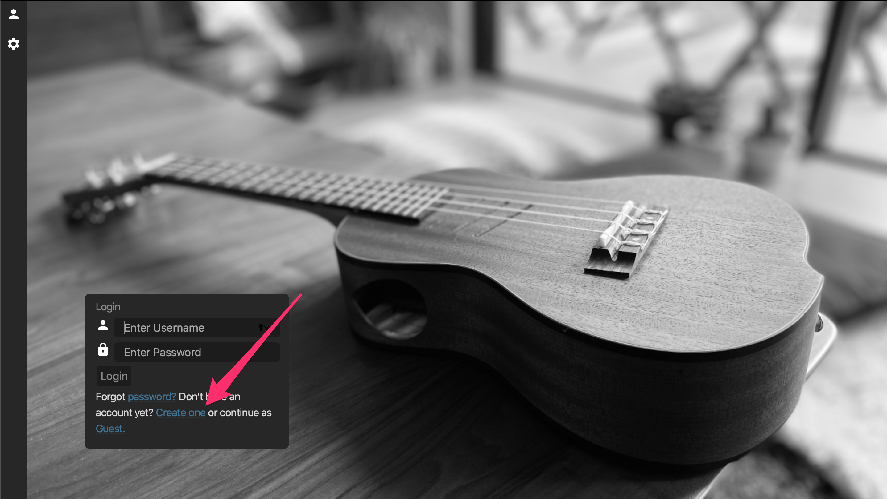
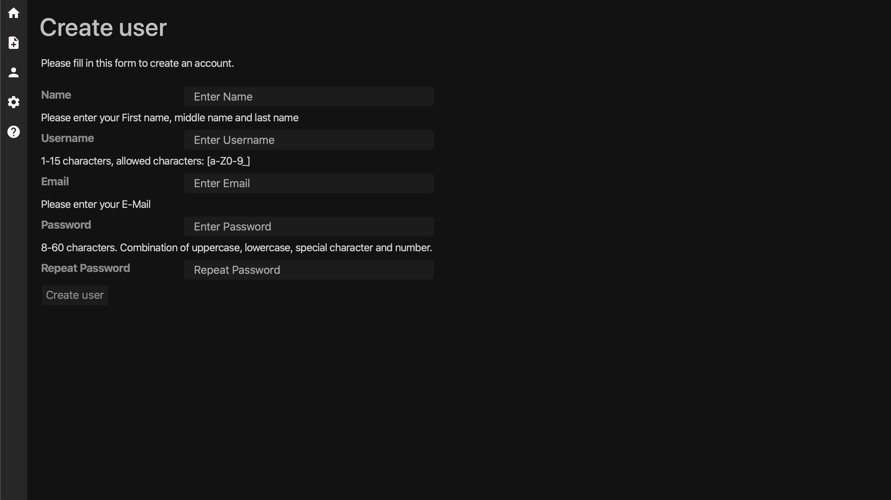
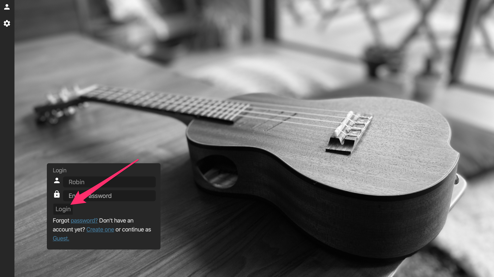
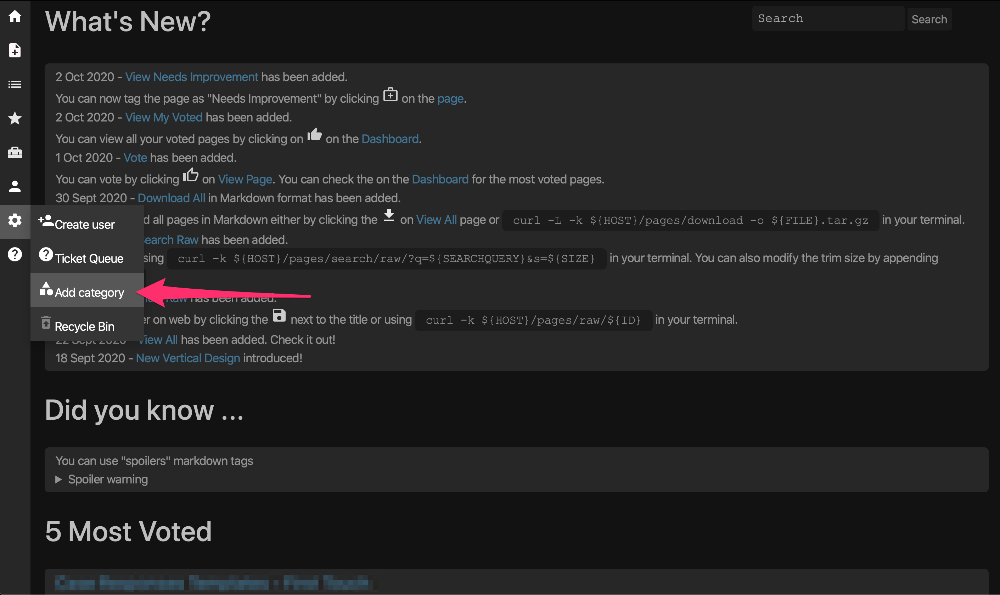
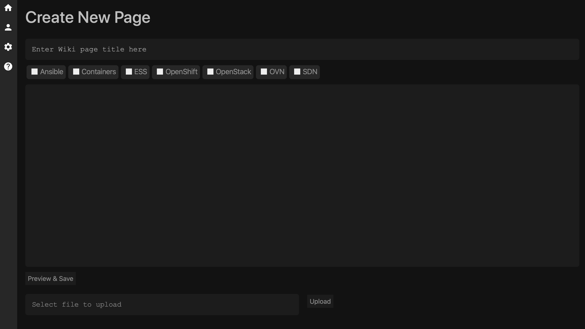

[](https://goreportcard.com/report/github.com/zerodayz/keepsake)

# Keepsake
This is Open Source Wiki written in Go, aims for simplicity over complexity. It is actively maintained and serves as Go development project.

Initial Wiki started off the Go Learning project (Web Go Application)[https://golang.org/doc/articles/wiki/]
Insipiration of some features from (jmoiron's gowiki)[https://github.com/jmoiron/gowiki] project last updated 4 years ago and from (ieyasu's go-bwiki)[https://github.com/ieyasu/go-bwiki] which had updates couple of months back.

The idea is to keep the Wiki as close to the standard libraries as possible, avoiding using any unnecessary third party libraries.

# What's New?
- **07 October 2020** - Today's Articles has been added.
- **02 October 2020** - View Needs Improvement has been added.  
You can now tag the page as "Needs Improvement" by clicking  on the page. 
- **02 October 2020** - View My Voted has been added.  
You can view all your voted pages by clicking on  on the Dashboard. 
- **01 October 2020** - Vote has been added.  
You can vote by clicking  on View Page. You can check the on the Dashboard for the most voted pages. 
- **30 September 2020** - Download All in Markdown format has been added. 
You can download all pages in Markdown either by clicking the  on View All page or `curl -L -k ${HOST}/pages/download -o ${FILE}.tar.gz` in your terminal. 
- **24 September 2020** - Search Raw has been added. 
Check it out by using `curl -k ${HOST}/pages/search/raw/?q=${SEARCHQUERY}&s=${SIZE}` in your terminal.  
You can also modify the trim size by appending `&s=${SIZE}` 
- **23 September 2020** - View Raw has been added. 
Check it out either on web by clicking the  next to the title or using `curl -k ${HOST}/pages/raw/${ID}` in your terminal. 
- **22 September 2020** - View All has been added. Check it out! 
- **18 September 2020** - New Vertical Design introduced!

# Use Keepsake in Docker
## Server without SSL
### Run the DB container
```
docker run --name gowiki-mysql -v $PWD/data/mysql:/var/lib/mysql:Z -p 3306:3306/tcp -p 80:80/tcp -e MYSQL_ROOT_PASSWORD=roottoor -e MYSQL_DATABASE=gowiki -e MYSQL_USER=gowiki -e MYSQL_PASSWORD=gowiki55 -d mariadb:latest
```
### Run the Keepsake container
```
docker run -d --network container:gowiki-mysql -e KEEPSAKE_DISABLE_SSL=1 --name keepsake quay.io/zerodayz/keepsake
```

The default port the wiki is listening on is `80`.
Navigate to `http://localhost` and enjoy.

## Server with SSL
## Run the DB container
```
docker run --name gowiki-mysql -v $PWD/data/mysql:/var/lib/mysql:Z -p 3306:3306/tcp -p 80:80/tcp -p 443:443/tcp -e MYSQL_ROOT_PASSWORD=roottoor -e MYSQL_DATABASE=gowiki -e MYSQL_USER=gowiki -e MYSQL_PASSWORD=gowiki55 -d mariadb:latest
```
### Run the Keepsake container

### Install TLS/SSL Cert
~~~
mkdir certs
openssl ecparam -genkey -name secp384r1 -out certs/server.key
openssl req -new -x509 -sha256 -key certs/server.key -out certs/server.crt -days 3650
~~~
This will generate server.key and server.crt for your Keepsake server.

```
docker run -d --network container:gowiki-mysql -v $PWD/certs:/certs:Z -e KEEPSAKE_SSL_KEY=/certs/server.key -e KEEPSAKE_SSL_CERT=/certs/server.crt --name keepsake quay.io/zerodayz/keepsake
```

The default port the wiki is listening on is `443`.
Navigate to `https://localhost` and enjoy.

## Dashboard


## Create new user




## Login to the Wiki


## Create new category


## Create new page


