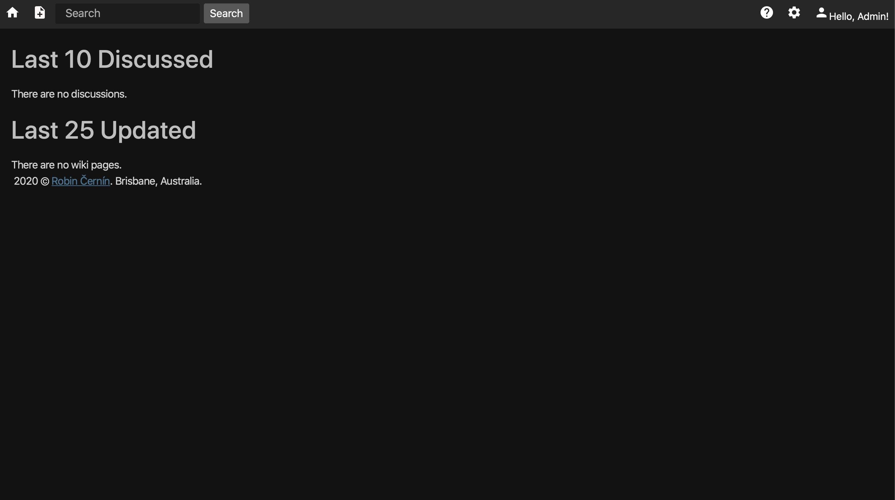
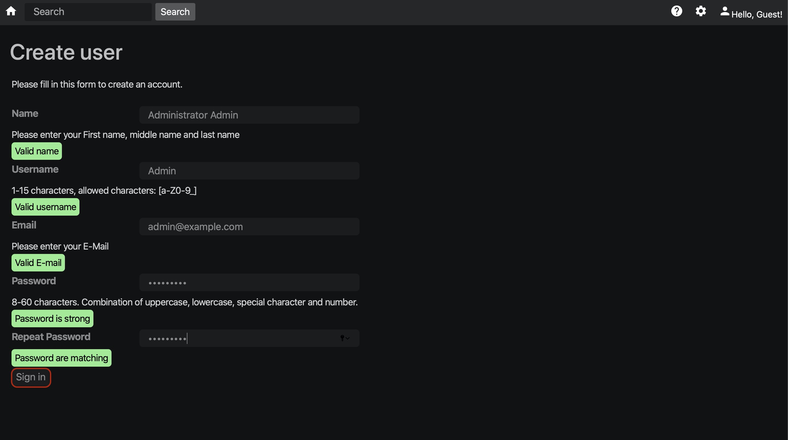
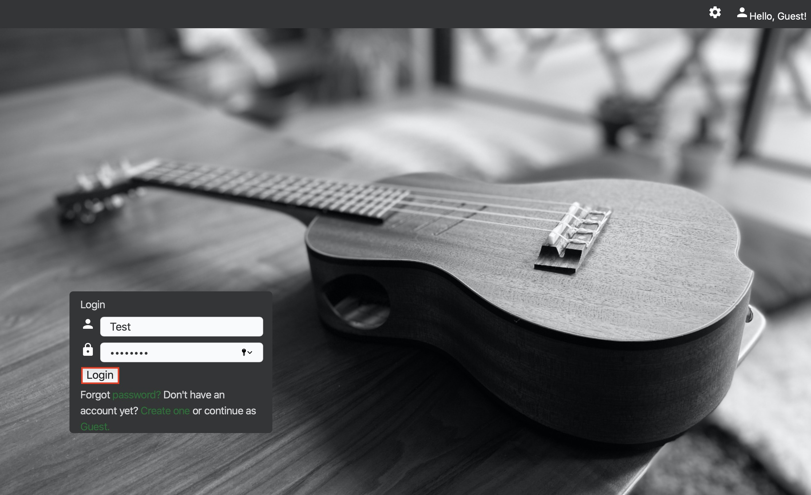
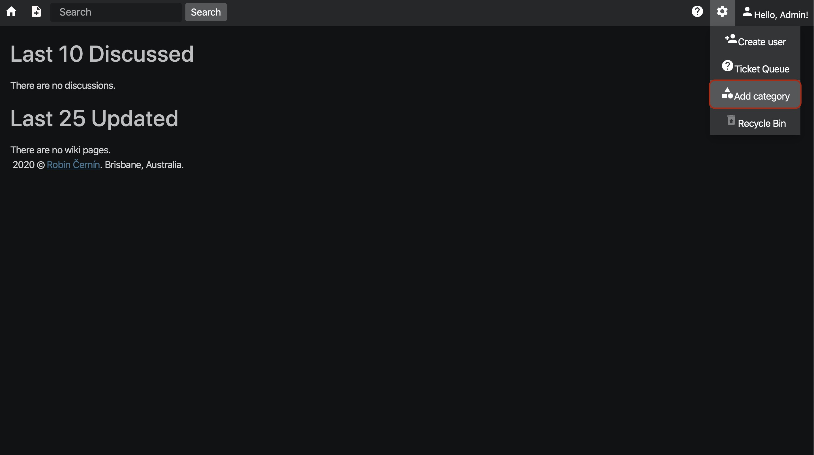
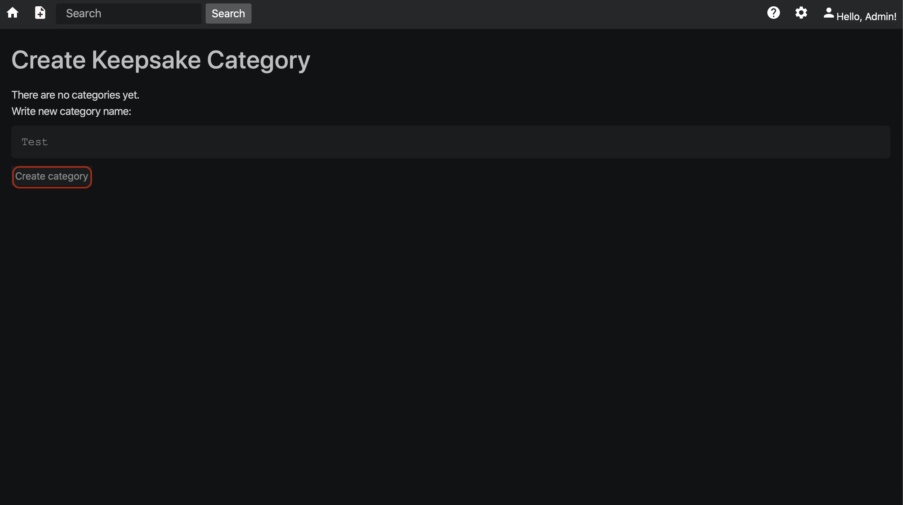
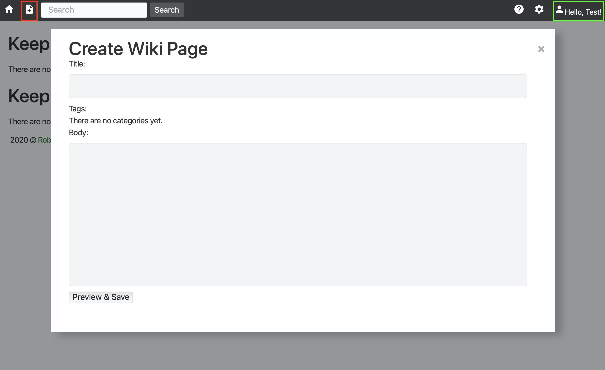
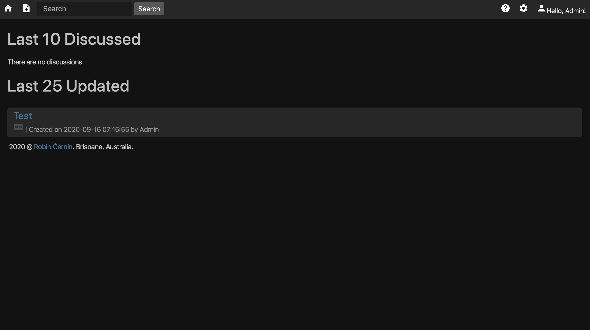

[](https://goreportcard.com/badge/github.com/zerodayz/gowiki)

# Keepsake
Wiki written in Go

# How to use
## Run the DB container
```
docker run --name gowiki-mysql -v $PWD/data/mysql:/var/lib/mysql:Z -p 3306:3306/tcp -e MYSQL_ROOT_PASSWORD=roottoor -e MYSQL_DATABASE=gowiki -e MYSQL_USER=gowiki -e MYSQL_PASSWORD=gowiki55 -d mariadb:latest
```

## Clone the keepsake into your own Filesystem
~~~
git clone git@github.com:zerodayz/keepsake.git
~~~
OR use HTTPS
~~~
https://github.com/zerodayz/keepsake.git
~~~

### Change directory to keepsake
~~~
cd keepsake
~~~

## Install TLS/SSL Cert
~~~
openssl ecparam -genkey -name secp384r1 -out server.key
openssl req -new -x509 -sha256 -key server.key -out server.crt -days 3650
~~~
This will generate server.key and server.crt for your Keepsake server.

## Build Keepsake server
~~~
go build wiki.go
~~~

## Run keepsake
~~~
./wiki
~~~

The default port the wiki is listening on is `443`.
Navigate to `https://localhost` and enjoy.

## Dashboard


## Create new user




## Login to the Wiki


## Create new category




## Create new page


## Dashboard



---
This is free wiki written in Go, for personal development purposes. 

Initial Wiki started off the Go Learning project (Web Go Application)[https://golang.org/doc/articles/wiki/]
Insipiration of some features from (jmoiron's gowiki)[https://github.com/jmoiron/gowiki] project last updated 4 years ago and from (ieyasu's go-bwiki)[https://github.com/ieyasu/go-bwiki] which had updates couple of months back.

The idea is to keep the Wiki as close to the standard libraries as possible, avoiding using any unnecessary third party libraries.

