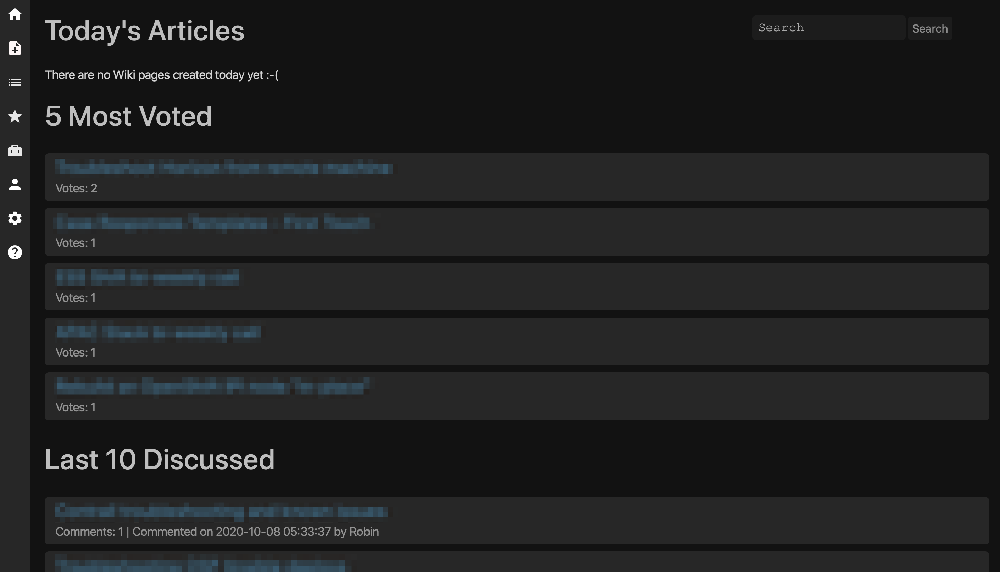

[](https://goreportcard.com/report/github.com/zerodayz/keepsake)


# Keepsake
This is Open Source Wiki written in Go, aims for simplicity over complexity. It is actively maintained and serves as Go development project.

The idea is to keep the Wiki as close to the standard libraries as possible, avoiding using any unnecessary third party libraries.



# Use Keepsake in OpenShift

## Clone the keepsake into your own Filesystem
```
git clone git@github.com:zerodayz/keepsake.git
```
OR use HTTPS
```
https://github.com/zerodayz/keepsake.git
```

### Change directory to keepsake
```
cd keepsake
```
### Build Keepsake server
```
oc apply -f keepsake-deploy.yaml
oc get route -n keepsake
NAME       HOST/PORT                                   PATH   SERVICES       PORT    TERMINATION   WILDCARD
keepsake   keepsake-keepsake.apps.example.com          /      keepsake-svc   <all>   edge          None
```

The default port the wiki is listening on is `443`.
Navigate to `https://keepsake-keepsake.apps.example.com` and enjoy.

# Use Keepsake in Docker
## Server without SSL
### Run the DB container
```
docker run --name gowiki-mysql -v $PWD/data/mysql:/var/lib/mysql:Z -p 3306:3306/tcp -p 80:80/tcp -e MYSQL_ROOT_PASSWORD=roottoor -e MYSQL_DATABASE=gowiki -e MYSQL_USER=gowiki -e MYSQL_PASSWORD=gowiki55 -d mariadb:latest
```
### Run the Keepsake container
```
docker run -d --network container:gowiki-mysql -e KEEPSAKE_DISABLE_SSL=1 --name keepsake quay.io/zerodayz/keepsake
```

The default port the wiki is listening on is `80`.
Navigate to `http://localhost` and enjoy.

## Server with SSL
## Run the DB container
```
docker run --name gowiki-mysql -v $PWD/data/mysql:/var/lib/mysql:Z -p 3306:3306/tcp -p 80:80/tcp -p 443:443/tcp -e MYSQL_ROOT_PASSWORD=roottoor -e MYSQL_DATABASE=gowiki -e MYSQL_USER=gowiki -e MYSQL_PASSWORD=gowiki55 -d mariadb:latest
```
### Run the Keepsake container

### Install TLS/SSL Cert
~~~
mkdir certs
openssl ecparam -genkey -name secp384r1 -out certs/server.key
openssl req -new -x509 -sha256 -key certs/server.key -out certs/server.crt -days 3650
~~~
This will generate server.key and server.crt for your Keepsake server.

```
docker run -d --network container:gowiki-mysql -v $PWD/certs:/certs:Z -e KEEPSAKE_SSL_KEY=/certs/server.key -e KEEPSAKE_SSL_CERT=/certs/server.crt --name keepsake quay.io/zerodayz/keepsake
```

The default port the wiki is listening on is `443`.
Navigate to `https://localhost` and enjoy.

# Use Keepsake in Baremetal
## Run the DB container
```
docker run --name gowiki-mysql -v $PWD/data/mysql:/var/lib/mysql:Z -p 3306:3306/tcp -e MYSQL_ROOT_PASSWORD=roottoor -e MYSQL_DATABASE=gowiki -e MYSQL_USER=gowiki -e MYSQL_PASSWORD=gowiki55 -d mariadb:latest
```

## Clone the keepsake into your own Filesystem
```
git clone git@github.com:zerodayz/keepsake.git
```
OR use HTTPS
```
https://github.com/zerodayz/keepsake.git
```

### Change directory to keepsake
```
cd keepsake
```
## Server without SSL
### Build Keepsake server
```
go build wiki.go
```

### Run keepsake
```
./wiki --no-ssl
```

The default port the wiki is listening on is `80`.
Navigate to `http://localhost` and enjoy.

## Server with SSL
### Install TLS/SSL Cert
```
mkdir certs
openssl ecparam -genkey -name secp384r1 -out certs/server.key
openssl req -new -x509 -sha256 -key certs/server.key -out certs/server.crt -days 3650
```
This will generate server.key and server.crt for your Keepsake server.

### Build Keepsake server
```
go build wiki.go
```

### Run keepsake
```
./wiki
```

The default port the wiki is listening on is `443`.
Navigate to `https://localhost` and enjoy.
